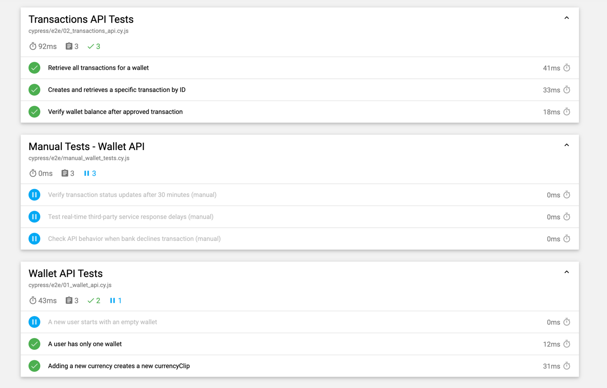

# Wallet API Test Automation

This project contains automated API tests for the Wallet service using **Cypress**.

## Prerequisites
- Node.js (LTS version recommended)
- npm or yarn
- Cypress installed globally or locally

## Installation
1. Clone the repository:
   ```sh
   git clone https://github.com/petricabobe/cypress_api_mock.git
   ```
2. Install dependencies:
   ```sh
   cd <project-folder>
   npm install
   ```

## Running Tests
Before running the tests, **ensure the API mock server is running**.

### Start the Prism Mock Server
This project uses **Prism** to mock the Wallet API. Instead of manually starting it, use the following command:
```sh
npm run mock-api
```
This will start the API mock server on `http://localhost:4010`.

### Run Cypress Tests
To execute tests and generate report:
```sh
npx cypress run
```
Or run tests in the Cypress UI:
```sh
npx cypress open
```
Reports will be available in the `cypress/reports` directory.

## Test Structure
- `cypress/e2e/wallet.cy.js` – Tests related to wallet creation and balance.
- `cypress/e2e/transactions.cy.js` – Tests related to wallet transactions.
- `cypress/fixtures/users.json` – Contains test users.

