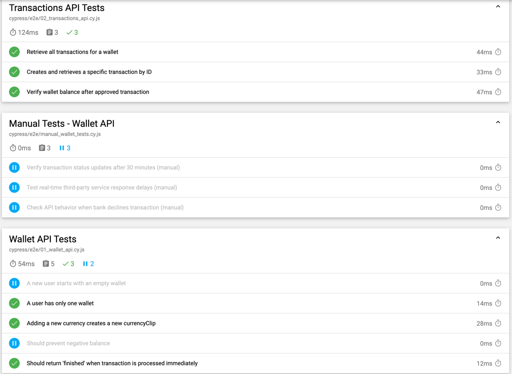

# Wallet API Test Automation

This project contains automated API tests for the Wallet service using **Cypress**.

## Prerequisites
- Node.js (LTS version recommended)
- npm or yarn
- Cypress installed globally or locally

## Installation
1. Clone the repository:
   ```sh
   git clone https://github.com/petricabobe/cypress_api_mock.git
   ```
2. Install dependencies:
   ```sh
   cd <project-folder>
   npm install
   ```

## Running Tests
Before running the tests, **ensure the API mock server is running**.

### Start the Prism Mock Server
This project uses **Prism** to mock the Wallet API. Instead of manually starting it, use the following command:
```sh
npm run mock-api
```
This will start the API mock server on `http://localhost:4010`.

### Run Cypress Tests
To execute tests and generate report:
```sh
npx cypress run
```
Or run tests in the Cypress UI:
```sh
npx cypress open
```
Reports will be available in the `cypress/reports` directory.

## Test Structure
- `cypress/e2e/wallet.cy.js` – Tests related to wallet creation and balance.
- `cypress/e2e/transactions.cy.js` – Tests related to wallet transactions.
- `cypress/fixtures/users.json` – Contains test users.




## Test Plan

### Implemented Test Cases
1. **Verify new wallet**
   - Verify that new user has one wallet.

2. **Retrieve wallet balance**
   - Ensure the balance is retrieved correctly after wallet creation.

3. **Create a transaction - Immediate Processing**
   - A transaction with sufficient balance should be processed immediately (`status: finished`).

4. **Create a transaction - Pending Processing**(Skipped)*
   - This test was intended to check if a transaction remains "pending" when an external service is slow, but it executes too quickly in the mock environment.

5. **Create a transaction - Insufficient Funds** 
   - Ensure that transactions fail if the wallet balance is too low.

6. **Create a transaction - Negative Amount **(Skipped)*
   - Intended to check rejection of negative amounts but is currently skipped.

7. **Retrieve a specific transaction** 
   - Verify that transaction details can be retrieved by ID.

8. **List all transactions for a wallet** 
   - Ensure that all transactions appear in the wallet history.

9. **Add a new currency to the wallet**
   - Validate that multiple currencies can exist in a wallet.

10. **Check wallet contains both initial and new currencies**
- Ensure a newly added currency does not remove the previous one.

### Unimplemented / Future Test Cases
1. **Concurrency Handling (Multiple Transactions at Once)**
   - Ensure that simultaneous transactions are processed correctly without conflicts.

2. **Transaction Reversal**
   - Validate the ability to reverse a transaction and update the balance accordingly.

3. **Transaction Expiry (Timeout Scenario)**
   - Test cases for transactions that remain "pending" for too long and get canceled.

---